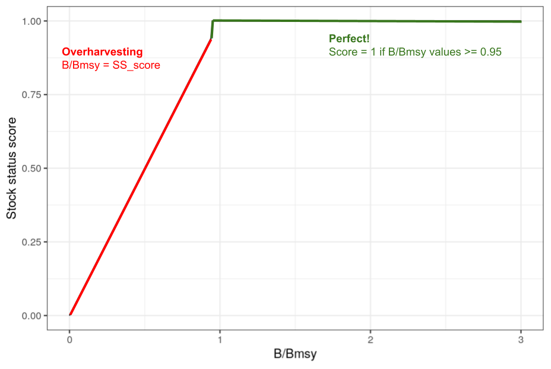

```{r}
library(tidyverse)
```

Work together to answer these questions.  

All the information you need should be in the OHI Methods [document](https://raw.githack.com/OHI-Science/ohi-global/published/documents/methods/Supplement.html#2_the_theory_of_ohi).

I will be around to answer any questions...so don't hesitate to get clarification, extra guidance, or request hints!

### OHI score models and data
1. What is the difference between a goal's "status" and "score"?

<br>
"status" is the current state of the goal relative to the desired “reference point." Values range from 0-100. "future status" incorporates trend in present status, pressure, and resilience. "score" is the average of the goal's present status and the goal's likely near-term future status.
<br>

2. If a region's food provision goal has the following values, what would its food provision score be?

Predicted future status: 80

Current status: 60

<br>
Its food provision score would be (60 + 80) / 2 = 70.
<br>

3. Given the following data, what would this region's Index score be?

Goal/subgoal  | Abbreviation   | Score
------------- | -------------- | -------------
Artisanal Fishing Opportunity | AO | 90
Habitat | HAB | 50
Species Condition | SPP | 30
Carbon Storage | CS | 20
Clean Waters | CW | 95
Coastal Livelihoods and Economies | LE | 60
Coastal Protection | CP | 80
Food Provision | FP | 85
Natural Products | NP | 100
Sense of Place | SP | 10
Tourism and Recreation | TR | 50


NOTE: The abbreviations for subgoals have 3 letters and goals have 2 letters.

<br>
First, we average subgoal scores to make scores for each goal: (50 + 30) / 2 = 40 = the goal score for Biodiversity. Then, we average all of goal scores for the Index score: (90 + 40 + 20 + 95 + 60 + 80 + 85 + 100 + 10 + 50) / 10 = 63.
<br>

4. Fill in the missing values.  

NOTE: Pressure and resilience must be multiplied by 0.01.  Trend and status are not modified. 

```{r}
xC1 <- 75
xC2 <- 75
T1 <- 0.10
T2 <- 0.10
p1 <- 100
p2 <- 50
r1 <- 50
r2 <- 50

xF1 <- (1 + (0.67*T1) + (1 - 0.67)*(0.01*r1 - 0.01*p1) ) * xC1 # 67.65
xF2 <- (1 + (0.67*T2) + (1 - 0.67)*(0.01*r2 - 0.01*p2) ) * xC2 # sanity check scenario 2's future status, should = 80, is 80.025

score1 <- (xC1 + xF1) / 2
score2 <- (xC2 + xF2) / 2
```


Dimension | Scenario 1 | Scenario 2
---------- | ---------- | ---------
Score      | `r score1` | `r score2`| 
Current status |  75 | 75
Predicted future status | `r xF1` |  80
Trend | 0.10 | 0.10
Pressure | 100 | 50
Resilience | 50 | 50


QUESTION: How did a pressure change from 100 to 50 affect the final score?  Was this a larger or smaller effect than you would have expected?

<br>
Pressure changing from 100 to 50 caused a change of `r score1-score2`. This is somewhat the effect I was expecting or perhaps larger than I was expecting, since pressure isn't as big of a factor as trend, for example.
<br>


### Humans as part of the ecosystem
<br>
5. To calculate the Fishery subgoal, we:

a. Obtain B/Bmsy  scores for each stock that is harvested.   B/Bmsy is defined as: the ratio of observed biomass to the biomass that would provide maximum sustainable yield. When B/BMSY = 1, then biomass equals BMSY. If B/BMSY falls below 1, biomass is too low to provide maximum sustainable yield. For example, if B/BMSY = 0.5, then biomass is only 50% of that needed for maximum sustainable yield. (from: http://www.catchshareindicators.org/wp-content/uploads/2013/12/NE_Biomass_Feb-2014.pdf)

b. Convert B/Bmsy into a stock status score that ranges from 0-1, with one reflecting a perfect score.  The relationship between B/Bmsy values and stock status scores looks like this:



c. Take some sort of average of the stock status scores within each region (for the global we use a geometric mean weighted by catch).

QUESTION: B/Bmsy scores greater than 1 indicate the stock is doing well, but is underharvested!  Given this, do you think we should penalize underharvesting? Why? Do you have any ideas for how we could account for underharvesting without unduly penalizing regions that are trying to let stocks recover? 

<br>
I think underharvesting should be penalized because this means fisheries could be benefiting more than they currently are, which is an nonoptimal use of resources. Perhaps we could leave regions trying to let stocks recover out of the calculation of the score. This way regions doing well get benefited, regions not doing well get penalized, and regions working on improving are not benefited nor penalized. You would really need to understand why they are underharvesting in order to penalize it.
<br>

### Gapfilling
6. Imagine you are calculating OHI scores for 10 regions.  The data you can find for an economic variable that is used to calculate the status of one of the goals looks like this:

rgn_id   | data
-------- | -------
1        | 72
2        | 74
3        | 80
4        | 70
5        | NA
6        | NA
7        | 71
8        | 75
9        | 76
10       | 76

QUESTION: Should the missing values (NA is a missing value in R) remain missing?  If so, why?

Or, should you try to estimate the missing values?  If so, how might you go about estimating them?
<br>
It would be better if they didn't remain missing, because then some regions may not get a score when they should, but the filled data need to be reasonably similar to the other data so regions are comparable still. We could estimate the missing values by averaging the values of regions with similar characteristics, or something along those lines. This would only be valid if these regions should indeed have scores though, and are not NA because they should actually be 0/really low, so some research may need to be conducted to see if this is the case.
<br>

### Goal status and trend
<br>

7. Read the methods section for the Lasting Special Places subgoal: https://oceanhealthindex.org/images/htmls/Supplement.html#692_Lasting_special_places_(subgoal_of_sense_of_place))

The information in this section describes how status and trend are calculated for this goal, it also includes the data used to calculate the pressure and resilience dimensions.

QUESTION: What is the reference point for this subgoal?

<br>
The target reference level is 30% of area protected. With respect to this, we also assume that all countries have roughly the same percentage of their coastal waters and coastline that qualify as lasting special places.
<br>

Explore the links to the pressures and resilience data layers.

Follow this link to the functions.R file in ohi-global: https://github.com/OHI-Science/ohi-global/blob/draft/eez/conf/functions.R

Find the Lasting Special Places function.  See if you can reconcile the model described in the Methods with the code. (NOTE: Just aim for a large picture overview...at this point you do not need to understand every step….or even most of this)

<br>
Considering the Methods equation describes using the proportion of coastal marine protected area, the proportion of coastline protected, and the reference point for both measures, I reconcile the offshore, inland, and total_area variables, as well as setting 30 as the references, as representing parts of those. After that, you can see the data being manipulated to calculate status and trend and then score. I didn't fully see code to calculate future in this area. Lastly, we can see the LSP function takes "layers" as an input to create a dataframe and run calculations.
<br>

8. The trend for the Tourism and Recreation goal for the United States is -0.15.  Describe what this means.

<br>
Trend is the proportional change in status predicted to occur in the most recent 5 years, which is typically calculated by estimating the yearly change in status using a linear regression model (i.e., slope estimate) of the five most recent years of status data and multiplying this value by 5 to estimate the change five years into the future. For proportional change, we divide this slope estimate by the status value of the oldest year of data used in this trend calculation. Since this is proportional change in status, range is from -1.0 to +1.0. -0.15 here then indicates a slight decrease in status. Status is predicted to decrease about 15% in 5 years. (a lot of this info came from https://oceanhealthindex.org/images/htmls/Supplement.html)
<br>

9. We are going to walk through a trend calculation.  If R is installed on your computer, follow along.

Status data for a region's Tourism and Recreation goal:

Year  | Status
------ | ----------
2010  | 72
2011  | 71
2012  | 72
2013  | 73
2014  | 77
2015  | 80
2016  | 82

*STEP 1* Estimate the average change per year using a linear regression model


```{r}
year <- 2012:2016
status <- c(0.72, 0.73, 0.77, 0.80, 0.82)
trend_model <- lm(status ~ year)
summary(trend_model)
```

The 0.027 value is the slope estimate, which is the average change in status per year estimated by the linear model.


*STEP 2* Obtain proportional change by dividing the slope estimate by the earliest status value used in the linear model:

`0.027/0.72 = 0.0375`

There has been nearly a 4% increase in status per year.

*STEP 3* The goal is to predict the change in 5 years, so we multiply the yearly proportional change by 5:

`0.0375 * 5 = 0.1875`

Status is predicted to increase about 19% in 5 years.

In 2021, status is predicted to be (ignoring pressure/resilience dimensions):
82 * (1 + 0.1875) = 97

QUESTION: What assumptions are we making by using this formulation of trend to calculate the likely future status?

<br>
We are assuming past measurements (specifically only these 5 years) are an accurate representation of what the future is going to look like. Some other assumption info from https://oceanhealthindex.org/images/htmls/Supplement.html: We assume a simple linear trend, which is not always the case due to a variety of variables such as altered pressures and resilience responses, nonlinear patterns in system response, stochastic environmental and biological variability, and simple bounding conditions (status cannot go below zero or above 1.0, and so the trend must level off as it approaches these values). Additionally, the same trend value could represent different processes, ie. declines due to unsustainable harvest of a resource can look identical to declines due to restrictions placed on resource users to allow the resource to recover. Lastly, it may be too short a time frame to determine true trends or the causes of those trends, but the intent here is more about informing the likely near-term trajectory.
<br>

QUESTION: Can you think of any scenarios when we would not use 5 years of data to estimate trend?

<br>
If there is no data for all 5 years is one scenario. In Table 6.2. Habitat data of https://oceanhealthindex.org/images/htmls/Supplement.html, we can also see examples of certain habitats getting trends calculated differently.
<br>

### Goal pressure and resilience
<br>

10. The pressure dimension plays a relatively small role in goal scores (see figure 4.1), but it takes a lot of effort to prepare the data!

The final pressure dimension is calculated for each region and goal using a function from the ohicore package.  The function requires several pieces of information:

a. A data layer for each pressure layer describing the magnitude of the pressure on a scale of 0-1.  For example, here is the sea surface temperature pressure layer (low pressures are good and high pressures are bad): https://github.com/OHI-Science/ohiprep_v2023/blob/gh-pages/globalprep/prs_sst/v2022/output/sst_updated.csv

b. Classifying the pressure category for each data layer. The pressure dimension is based on two types of pressures: Ecological and Social (Figure 4.2).  The ecological pressures are broken into 5 categories (pollution, alien species, habitat destruction, fishing, and climate change).  Each pressure data layer is assigned to a category in this file: https://github.com/OHI-Science/ohi-global/blob/draft/eez/conf/pressure_categories.csv

QUESTION: How many climate change pressures are there? 

<br>
There are 4.
<br>

c. Pressure x goal weighting. Pressures have little or no effect on some goals, but huge effects on others.  The relationship between the goals and the pressure variables is described here: https://github.com/OHI-Science/ohi-global/blob/draft/eez/conf/pressures_matrix.csv

QUESTION: Which pressure layers affect the FIS  subgoal?  How many regulatory pressure layers are there?  How many social layers are there?  Which is more important: Ecological or Social pressures? 

```{r}
# Read in matrix data
pressure_matrix <- read_csv("https://raw.githubusercontent.com/OHI-Science/ohi-global/draft/eez/conf/pressures_matrix.csv") 

# Get only for FIS
fis_pressure <- pressure_matrix %>% 
  filter(goal == "FIS") %>%
  select_if(~ !any(is.na(.))) %>%
  select(-goal)

# These pressure layers affect the FIS subgoal
colnames(fis_pressure)

# Read in categories
pressure_categories <- read_csv("https://raw.githubusercontent.com/OHI-Science/ohi-global/draft/eez/conf/pressure_categories.csv")

relevant_pressures <- pressure_categories %>%
  filter(layer %in% colnames(fis_pressure))

relevant_pressures
# We can see 11 ecological (assuming these are regulatory) and 2 social
# Both get equally weighted, despite being different numbers of layers
```


QUESTION: Some goals, like Coastal Protection, have multiple “elements”.  Why? 
<br>
Elements are different factors that go into certain goals, ie. habitats for Coastal Protection: the status is calculated as relative health of the habitats within a region that provide shoreline protection, weighted by their area and protectiveness rank. These are necessary to account for the differences between different elements within a goal. With elements, we are able to apply pressures to specific habitats.
<br>

NOTE: It is convention to add a superscript to the pressure name that describes its category:
* po=pollution
* hd=habitat destruction
* sp=alien species
* fp=fishing pressure
* cc=climate change


11.  Similar to the pressures dimension, resilience plays a relatively small role in goal scores (see figure 4.1) but still takes a lot of effort.

The final pressure dimension is calculated for each region and goal using a function from the ohicore package.  The function requires several pieces of information:

a. A data layer for each pressure layer describing the magnitude of the pressure on a scale of 0-1. For example, here is the Social Progress Index layer (low resilience is bad and high resilience is good): https://github.com/OHI-Science/ohiprep_v2023/blob/gh-pages/globalprep/prs_res_spi/v2022/output/spi_res.csv

b. The resilience dimension includes two major categories: Ecological and Social (Figure 4.3). Ecological resilience has two subcategories: Ecosystem and Regulatory.  Regulatory is comprised of the same 5 subcomponents as the Ecological *pressures*: pollution, alien species, habitat destruction, fishing, and climate change.  There is also a “goal” specific subcomponent.   Each resilience data layer is assigned to a category in this file: https://github.com/OHI-Science/ohi-global/blob/draft/eez/conf/resilience_categories.csv

c. The relationship between goals and resilience is described here: https://github.com/OHI-Science/ohi-global/blob/draft/eez/conf/resilience_matrix.csv
<br>
<br>

### Data layers
<br>

12. Explore table 7.0.1 in the methods. 

<br>
This outlines data layers and sources.
<br>

