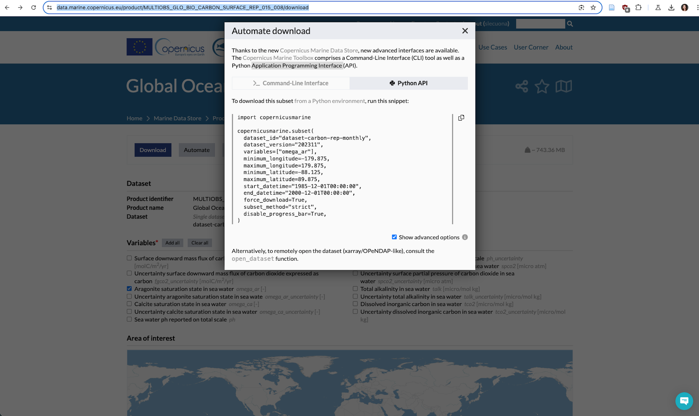

# Summary

**Overview**

The [data source product](https://data.marine.copernicus.eu/product/MULTIOBS_GLO_BIO_CARBON_SURFACE_REP_015_008/description) corresponds to a REP L4 time series of monthly global reconstructed surface ocean pCO2, air-sea fluxes of CO2, pH, total alkalinity, dissolved inorganic carbon, saturation state with respect to calcite and aragonite, and associated uncertainties on a 0.25° x 0.25° regular grid. The product is obtained from an ensemble-based forward feed neural network approach mapping situ data for surface ocean fugacity (SOCAT data base, Bakker et al. 2016, <https://www.socat.info/>) and sea surface salinity, temperature, sea surface height, chlorophyll a, mixed layer depth and atmospheric CO2 mole fraction. Sea-air flux fields are computed from the air-sea gradient of pCO2 and the dependence on wind speed of Wanninkhof (2014). Surface ocean pH on total scale, dissolved inorganic carbon, and saturation states are then computed from surface ocean pCO2 and reconstructed surface ocean alkalinity using the CO2sys speciation software \[See: Citation information\].

Specifically, we want to evaluate aragonite saturation. This is because it is a good metric for ocean acidification pressure on marine organisms. Some sources referring to this include:

[Ocean Acidification \| Learn Science at Scitable](https://www.nature.com/scitable/knowledge/library/ocean-acidification-25822734/)

1)  $CO_2(aq) + H_2O ↔ H_2CO_3$
2)  $H_2CO_3 ↔ HCO_3^- + H^+$
3)  $HCO_3^- ↔ CO_3^{2-} + H^+$
4)  $CO_2(aq) + CO_3^{2-} + H_2O → 2HCO_3^-$

For **supersaturated** (Ω \> 1) conditions, with an excess of \[ $CO_3^{2-}$ \]seawater, a crystal of $CaCO_3$ will tend to grow, and in **undersaturated** (Ω \< 1) conditions, \$CaCO_3\$ will dissolve. \[$CO_3^{2-}$\]saturation is a weak function of temperature and salinity but a strong function of water depth (pressure) meaning that deeper waters are typically more corrosive. How \[saturation level\] affects calcifying organisms is difficult to predict however, because different species exert varying degrees of biological control on the calcification process. **Therefore, it may be a better idea to look at the current level of aragonite.**

[Ocean Acidification: Saturation State - Science On a Sphere](https://sos.noaa.gov/catalog/datasets/ocean-acidification-saturation-state/#:~:text=Aragonite%20saturation%20state%20is%20commonly,organisms%20with%20calcium%20carbonate%20structures)

Aragonite saturation state is commonly used to track ocean acidification because **it is a measure of carbonate ion concentration**. Aragonite is one of the more soluble forms of calcium carbonate and is [widely used by marine calcifiers]{.underline} (organisms with calcium carbonate structures).

[Climate Change Indicators: Ocean Acidity \| US EPA.](https://www.epa.gov/climate-indicators/climate-change-indicators-ocean-acidity#:~:text=The%20global%20map%20in%20Figure,data%20(2006%E2%80%932015).)

Aragonite is a specific form of calcium carbonate that many organisms produce and use to build their skeletons and shells, and the saturation state is a measure of how easily aragonite can dissolve in the water.

The **lower** the saturation level, the **more difficult** it is for organisms to build and maintain their protective skeletons and shells.

Aragonite saturation has only been measured at selected locations during the last few decades, but it can be calculated reliably for different times and locations based on the relationships scientists have observed among aragonite saturation, pH, dissolved carbon, water temperature, concentrations of carbon dioxide in the atmosphere, and other factors that can be measured.

# Updates from 2024 assessment

Will be filled as the data is evaluated...

# Data Source

### Classification

**Reference:** [Copernicus Marine Service](https://data.marine.copernicus.eu/product/MULTIOBS_GLO_BIO_CARBON_SURFACE_REP_015_008/description)

**Downloaded:**

**Description**: Aragonite Saturation State $\Omega_{arg}$

**Full name:** Global Ocean Surface Carbon

**Product ID:** MULTIOBS_GLO_BIO_CARBON_SURFACE_REP_015_008

**Source:** In-situ observations

**Spatial extent:** Global OceanLat -88.12° to 89.88°Lon -179.87° to 179.88°

**Spatial resolution:** 0.25° × 0.25°

**Temporal extent:** 31 Dec 1984 to 30 Nov 2022

**Temporal resolution:** Monthly

**Processing level:** Level 4

**Variables:** Dissolved inorganic carbon in sea water (DIC), Sea water pH reported on total scale (pH), Surface partial pressure of carbon dioxide in sea water (spCO2), Surface downward mass flux of carbon dioxide expressed as carbon (fpCO2), Total alkalinity in sea water

**Feature type:** Grid

**Blue markets:** Conservation & biodiversity, Climate & adaptation, Science & innovation, Marine food

**Projection:** WGS 84 / World Mercator (EPSG 3395)

**Data assimilation:** None

**Update frequency:** Annually

**Format:** NetCDF-4

**Originating centre:** LSCE (France)

**Last metadata update:** 30 November 2023

# Methods

## Setup

```{r setup,message=FALSE,warning=FALSE,verbose=FALSE}

#set options for all chunks in code
knitr::opts_chunk$set(warning=FALSE, message=FALSE,fig.width=6, fig.height=6)

# load packages
if (!require(librarian)){
  install.packages("librarian")
  library(librarian)
}
librarian::shelf(
  here,
  CopernicusMarine,
  janitor,
  raster,
  terra,
  maps,
  httr,
  jsonlite,
  purrr,
  tictoc,
  sf,
  googleVis,
  RColorBrewer,
  foreach,
  doParallel, # for using multiple cores, if needed
  tidyverse, 
  plotly,
  zoo, # for gapfilling
  pdftools, # for FAO yearbook
  ohicore,
  reticulate,
  ggplot2,
  reticulate, # for python coding
  ncmeta,
  ncdf4,
  threadr #remotes::install_github("skgrange/threadr") # for na_extrapolate, GAPFILLING (if necessary)
)

# ---- sources! ----
source(here("workflow/R/common.R")) # file creates objects to process data

# ---- set year and file path info ----
current_year <- 2024 # Update this in the future!!
version_year <- paste0("v",current_year)
data_dir_version_year <- paste0("d", current_year)

# ---- data directories ----

# Raw data directory (on Mazu)
raw_data_dir <- here::here(dir_M, "git-annex", "globalprep", "_raw_data")

# CMS (Copernicus Marine Service) raw data directory
cms_dir <- here(raw_data_dir, "CMS", data_dir_version_year)

# prs_oa dir
oa_dir <- here(dir_M, "git-annex", "globalprep", "prs_oa", version_year)

# output data dir for intermediate data products
int_dir <- here(oa_dir, "int")
dir.create(int_dir)

# set colors
cols = rev(colorRampPalette(brewer.pal(9, 'Spectral'))(255)) # rainbow color scheme

# Assign the mollweide projection label, this does not transform the crs (for that we would use the function project(raster_name) after we create the raster) 
mollCRS <- CRS("+proj=moll") 

# Read in ocean raster with cells at 1km -- template for resampling (held on an NCEAS server)
ocean <- terra::rast(here(dir_M, "git-annex","globalprep", "spatial", "v2017", "ocean.tif"))
```

```{r, eval = FALSE}
plot(ocean) # examine the .tif and ensure it looks correct
crs(ocean) # v2024: "PROJCRS[\"Mollweide\",\n
```

## Install copernicusmarine tool in python

For the next two chunks, we will be using a Python Library API (Application Programming Interface) to automate the download of the data. In Quarto documents, you are able to fluidly exchange between python and R code by specifying what language will be used in the chunk name. This is extremely helpful for us, as it allows us to use the python API on the [CMS website](https://data.marine.copernicus.eu/product/MULTIOBS_GLO_BIO_CARBON_SURFACE_REP_015_008/download). Here are the steps to download the data properly:

1.  Login to CMS: go to their website and make your username and password. It is quick and should be usable immediately after the credentials have been made.
2.  Go to <https://data.marine.copernicus.eu/product/MULTIOBS_GLO_BIO_CARBON_SURFACE_REP_015_008/description>. This is the link to the "Global Ocean Surface Carbon" product. Ensure that you read the overview and check for any changes from the previous year (references, characteristics, etc).
3.  Click the "Download data" button. FYI: the button itself does not have words on it, it is just an arrow pointing downwards. It is in the upper right hand corner of the page, next to the star and map icons.
4.  This will bring you to their graphical tool download page. For the **Variables**, "Clear all" and select only "Aragonite saturation state in sea water: *omega_ar \[-\]*". Scroll to the bottom of the page, and under **Date Range**, specify 2010-01-01 at a time of 00:00:00 to your current year, 20xx-12-01 at a time of 00:00:00, to ensure you are obtaining the full year.
5.  After, instead of clicking the dark blue "Download" button, you will select the grey "Automate" button. Select Python API, and copy the `copernicusmarine.subset()` code. **Part of this code will be pasted on line 243 - 255.**

[{fig-align="center"}](https://data.marine.copernicus.eu/product/MULTIOBS_GLO_BIO_CARBON_SURFACE_REP_015_008/download)

```{python}
# first, we need to install the CMS tool using python!

# these are "modules", much like packages in R
import sys
import subprocess

def install(package): # a function to download the copernicusmarine package
    subprocess.check_call([sys.executable, "-m", "pip", "install", package]) # `sys.executable` is the path to the python executable. for example, "/usr/bin/python3".  This makes the process more reproducible because on the server the sys.executable for python could be different based on the individual.
    #"-m" tells the Python interpreter to run a module, in this case "pip", as a script, using the new function "install" that we created using `def` and inputting the name of the function for the variable "package"

try:
    install("copernicusmarine") # use the function to download the package
    import copernicusmarine # will import the package copernicusmarine.
    # if the package is already installed, the rest of the code will be skipped
except ImportError:
    print(f"Installing copernicusmarine...") # if it does not work, this will print in the console. 

print(f"copernicusmarine version: {copernicusmarine.__version__}") # if correctly downloaded, then it will print the version
# v2024: copernicusmarine version: 1.3.1
```

## Automated download of raw data

See steps above for clarification.

```{python}
# This layer lags by 2 years, since we need a full year of data. 

# v2024: username <- slecuona; password <- OceanHealth2024

import os
import copernicusmarine

# set the credentials made on the CMS website
copernicusmarine.login(username='slecuona', password='OceanHealth2024') 
# v2024: INFO - 2024-07-30T16:04:43Z - Credentials file stored in /home/lecuona/.copernicusmarine/.copernicusmarine-credentials.

# define cms_dir, since the python chunk cannot read objects from previous R chunks/in your environment
dir_M = "/home/shares/ohi"
current_year = 2024 # UPDATE!
version_year = f"v{current_year}" # using an f-string
data_dir_version_year = f"d{current_year}"
raw_data_dir = os.path.join(dir_M, "git-annex", "globalprep", "_raw_data") # os.path.join is part of the os module and will merge into a single path
cms_dir = os.path.join(raw_data_dir, "CMS", data_dir_version_year) # for the specific CMS folder within _raw_data

# make sure the directory exists
os.makedirs(cms_dir, exist_ok=True) # will create the dir if it does not already exist

# use copernicusmarine to download the data --this is from the python API copyable code on the CMS site
# ============== Update each year!!!!================
copernicusmarine.subset(
    dataset_id="dataset-carbon-rep-monthly",
    dataset_version="202311",
    variables=["omega_ar"],
    minimum_longitude=-179.875,
    maximum_longitude=179.875,
    minimum_latitude=-88.125,
    maximum_latitude=89.875,
    start_datetime="2010-01-01T00:00:00",
    end_datetime="2022-12-01T00:00:00",
    force_download=True,
    subset_method="strict",
    disable_progress_bar=False,
    
    output_filename=os.path.join(cms_dir, "global_aragonite_saturation_raw.nc") ## This line is not copied!!! Need it to specify the filezilla directory for the data to download to
    
) # v2024 python API download code, which will download as a singular multi-layer NetCDF file (nc-file)

print(f"Data downloaded to: {os.path.join(cms_dir, 'global_aragonite_saturation_raw.nc')}") # print in console: data download finished!
```

### Historical Data Download

This will be used as a reference point when rescaling later on. The mean of the historical data (1985 - 2000) from CMS will be used. The download process is the same as for the new yearly data, however it has a different **Date Range** (1985-01-01T00:00:00 - 2000-12-01T00:00:00). Each year, the only thing that should change is the "current_year" object, unless there has been a reevaluation and the dates used for the historical reference point is changed.

```{python}
import os
import copernicusmarine

# define cms_dir, since the python chunk cannot read objects from previous R chunks/in your environment
dir_M = "/home/shares/ohi"
current_year = 2024 # UPDATE!
version_year = f"v{current_year}" # using an f-string
data_dir_version_year = f"d{current_year}"
raw_data_dir = os.path.join(dir_M, "git-annex", "globalprep", "_raw_data") # os.path.join is part of the os module and will merge into a single path
cms_dir = os.path.join(raw_data_dir, "CMS", data_dir_version_year) # for the specific CMS folder within _raw_data

# make sure the directory exists
os.makedirs(cms_dir, exist_ok=True) # will create the dir if it does not already exist

# use copernicusmarine to download the data --this is from the python API copyable code on the CMS site
copernicusmarine.subset(
  dataset_id="dataset-carbon-rep-monthly",
  dataset_version="202311",
  variables=["omega_ar"],
  minimum_longitude=-179.875,
  maximum_longitude=179.875,
  minimum_latitude=-88.125,
  maximum_latitude=89.875,
  start_datetime="1985-01-01T00:00:00",
  end_datetime="2000-12-01T00:00:00",
  force_download=True,
  subset_method="strict",
  disable_progress_bar=True,
  
  output_filename=os.path.join(cms_dir, "historical_1985_2000_aragonite_saturation_raw.nc") ## This line is not copied!!! Need it to specify the filezilla directory for the data to download to
    
) # v2024 python API download code, which will download as a singular multi-layer NetCDF file for the historical data (nc-file)
  
print(f"Data downloaded to: {os.path.join(cms_dir, 'historical_1985_2000_aragonite_saturation_raw.nc')}") # print in console: data download finished!
```

### Manual download of raw data, if automation has issues

```{r}
# open the NetCDF file
file_path <- here::here(raw_data_dir, "CMS", "d2024_manual", "dataset-carbon-rep-monthly_1722109120120.nc") # file path to the manually downloaded raw data
```

## Rasterize and Project the Multi-Layer NetCDF

```{r}
# open the NetCDF file
raw_file_path <- here::here(cms_dir, "global_aragonite_saturation_raw.nc") # file path to the API downloaded raw data

# load the file as a SpatRaster to begin with, for greater usability with terra
oa_multi_raster <- terra::rast(raw_file_path)

# check the current CRS: will need to be reprojected to mollweide so that it can be clipped to the OHI eez layer
crs(oa_multi_raster) # v2024: ""GEOGCRS[\"WGS 84 (CRS84)\",\n".  
plot(oa_multi_raster) # to get a quick visualization of the multi-layer SpatRaster

# reproject to Mollweide for OHI consistency
# the `terra::project` function by default uses bilinear interpolation for continuous data (used bc the dataset does not have clear boundaries) and nearest neighbor for categorical data (not used in this case, but just to know)
mollCRS <- "+proj=moll +lon_0=0 +x_0=0 +y_0=0 +ellps=WGS84 +datum=WGS84 +units=m +no_defs" # mollweide EPSG for reprojecting

tic()
nc_raster_moll <- terra::project(oa_multi_raster, mollCRS) # using terra::project, which inherently resamples using bilinear interpolation
toc() # v2024: 98.562 sec elapsed

plot(nc_raster_moll)
```

### Resample and Mask

As seen above, after projecting to Mollweide, the rasters have purple rectangles in areas where there should not be values. To fix this and avoid issues in the future, it may be good to use the `ocean.tif` read as an object "ocean" within the setup chunk and make the resolution equal to our data's resolution. We can then mask the multi-layer SpatRaster of our data to the resampled `ocean`, ensuring that the CRS, extent, and resolution is all the same between the two.

```{r}
# project the data to the `ocean.tif` 
nc_moll_ocean <- terra::project(oa_multi_raster, terra::crs(ocean))

# > terra::res(ocean) == terra::res(nc_moll_ocean)
# [1] FALSE FALSE
# > terra::res(ocean) > terra::res(nc_moll_ocean)
# [1] FALSE FALSE
# > terra::res(ocean) < terra::res(nc_moll_ocean)
# [1] TRUE TRUE

# plot(nc_moll_ocean)

# resample the `ocean.tif` to the same resolution as our data, allowing us to mask
ocean_res_to_nc <- terra::resample(x = ocean, y = nc_moll_ocean)

# > terra::res(ocean_res_to_nc) == terra::res(nc_moll_ocean)
# [1] TRUE TRUE
# > terra::ext(ocean_res_to_nc) == terra::ext(nc_moll_ocean)
# [1] TRUE
```

```{r}
# mask to ocean extent
tic()
ocean_mask_test <- terra::mask(x = nc_moll_ocean, mask = ocean_res_to_nc)
toc()

plot(ocean_mask_test)

# ---- mask to `rgns_3nm_offshore_mol.tif`----
# read it in
rgns_3nm_offshore <- terra::rast(here(dir_M, "git-annex","globalprep","spatial","v2018","rgns_3nm_offshore_mol.tif"))

crs(rgns_3nm_offshore)

# resample to same resolution as nc_moll_ocean
resamp_3nm_offshore <- terra::resample(x = rgns_3nm_offshore, y = nc_moll_ocean)

# mask nc_moll_ocean to the eezs by region
tic()
oa_global_eez_multi <- terra::mask(x = nc_moll_ocean, mask = resamp_3nm_offshore)
toc()

plot(oa_global_eez_multi$omega_ar_1)
```

### Save as individual rasters

```{r}
# ---- create directory for storing the monthly individual rasters ----
int_monthly_dir <- here::here(int_dir, "oa_monthly_rasters")
dir.create(int_monthly_dir, showWarnings = TRUE) # to create the directory in case it has not already been made in Mazu

# since nc_raster is already loaded as a SpatRaster object
# check the number of layers
num_layers <- terra::nlyr(nc_raster_moll)
print(num_layers) # v2024: 156 layers, which makes sense because the data goes from 2010 - 2022 monthly

# get the time attribute for each layer, to check that it goes from 2010 - 2022 (v2024)
time_attribute <- terra::time(nc_raster_moll)
print(time_attribute)

# Create a list to store individual rasters
individual_rasters <- list()

# loop through each layer and create individual rasters from the SpatRaster
for (i in 1:num_layers) {
  layer <- nc_raster_moll[[i]] # the layer in the seq from 1:156 (v2024)
  date <- time_attribute[i] # the month, in this case, of the raster
  layer_name <- format(date, "%Y-%m-%d") # the name for the .tif when it is saved
  individual_rasters[[layer_name]] <- layer # put them in the list 
}

# print the names of the individual rasters in the list, to ensure the loop worked
names(individual_rasters) # v2024: "2010-01-01" - "2022-12-01"

# save individual rasters to files on filezilla at `int_monthly_dir`
tic()
for (name in names(individual_rasters)) {
  output_file <- file.path(int_monthly_dir, paste0(name, ".tif")) # move each raster to the specified path in Mazu
  writeRaster(individual_rasters[[name]], filename = output_file, overwrite = TRUE) # if files already exist, overwrite them
  print(paste("Saved:", output_file)) # allows us to see the names of the files as they are being saved
} #great! check filezilla that files are all there
toc() #v2024: 1904.563 sec elapsed

# let's take a look at one of the monthly rasters we just saved
rast_2010_01_01 <- rast(here::here(int_monthly_dir, "2010-01-01.tif")) # read it in and rasterize it using terra
plot(rast_2010_01_01, main = "Aragonite Saturation Raster - January 1, 2010", xlab = "Longitude", ylab = "Latitude") # plot it!

is.lonlat(rast_2010_01_01) # FALSE, so it does not currently have a long/lat crs...
```

# Historical Mean Reference

The historical mean of aragonite saturation from 1985 - 2000 will be used for comparison, to calculate the pressure scores.

```{r hist_mean}
# read in NetCDF file we downloaded using the API
oa_hist_multilayer_nc <- terra::rast(here::here(cms_dir, "historical_1985_2000_aragonite_saturation_raw.nc")) 

# needs to be reprojected
crs(oa_hist_multilayer_nc) # v2024: GEOGCRS[\"WGS 84 (CRS84)\",\n

oa_hist_moll_nc <- project(oa_hist_multilayer_nc, ocean) # reproject to Mollweide

plot(oa_hist_moll_nc) # this is monthly data; we need to stack the raster layers by year and calculate the overall mean across all years for a historical average reference
```

```{r}
# since it already multilayer and we plan on averaging across all years, we can make it a RasterBrick. It is similar to a RasterStack (that can be created with `stack()`), but processing time should be shorter when using a RasterBrick (from documentation)
oa_hist_moll_brick <- brick(oa_hist_moll_nc)

# Calculate the mean across all layers and years
tic()
oa_historical_average <- terra::mean(oa_hist_moll_brick) 
toc() # v2024: 88.751 sec elapsed

# write the result to a new raster file for future use
terra::writeRaster(oa_historical_average, 
            filename = here::here(int_dir, "oa_1985_2000_historical_average.tif"), # save to filezilla
            format = "GTiff",
            overwrite = TRUE)
```

# Annual mean aragonite saturation

Annual mean aragonite saturation rasters calculated from the monthly data.

```{r msla_monthly_to_annual, eval = F}
# ---- create directory for storing the monthly individual rasters ----
oa_annual_mean_dir <- here::here(int_dir, "oa_annual_mean")
dir.create(oa_annual_mean_dir, showWarnings = TRUE) # to create the directory in case it has not already been made in filezilla

## remember from "Setup" chunk: int_dir
## individual_rasters is the list of .tifs

# make a list of the already saved monthly rasters
oa_monthly_files <- list.files(path = here(int_monthly_dir),
                               pattern = "\\.tif$", # to ensure we only grab the .tif files, not the .tif.aux.json files
                               full.names = TRUE) # returns the full path, not just the file name

# the minimum year of the individual rasters
minyr <- substr(oa_monthly_files, 75, 78) %>% # taking the string that defines the year the raster's data was from 
  as.numeric() %>% 
  min()

# the maximum year of the individual rasters
maxyr <- substr(oa_monthly_files, 75, 78) %>% # taking the string that defines the year the raster's data was from 
  as.numeric() %>% 
  max() # take the max of all the years for the data downloaded

tic()
## stack all rasters for each year, calculate the annual mean, then write as a raster
registerDoParallel(6)
foreach(yr = c(minyr:maxyr)) %dopar% { # check that the minyr and maxyr are correct with what you downloaded
  
  files <- oa_monthly_files[str_detect(oa_monthly_files, as.character(yr))] # of the list earlier, detect the year from each file so that we can stack them by year
  
  rast_annual_mean <- stack(files) %>%
    calc(mean, na.rm = TRUE) %>% # calculate the average for each year for each cell in the raster over all the months, creating a raster of the average values for that year
    terra::writeRaster(filename = sprintf("%s/oa_annual_mean/oa_annual_%s.tif", int_dir, yr),
                       overwrite = TRUE)
}
toc()
# v2024 - 23.944 sec elapsed
```

# Rescale from 0 to 1

This pressure layer is rescaled so that all values lie between 0 and 1 using both a historical reference period and a biological reference point.

As a reminder, **supersaturated** conditions are when Ω \> 1, with an excess of \[ $CO_3^{2-}$ \]seawater, where a crystal of $CaCO_3$ will tend to grow. **Undersaturated** conditions are when Ω \< 1, of which $CaCO_3$ will dissolve.

All cells with values less than one, indicating an undersaturated state, are set equal to the highest stressor level, 1. For all other cells, rescaling the aragonite staturation state value to between 0 and 1 relies upon the change in saturation relative to the reference period.

Deviation from aragonite saturation state is determined for each year in the study period using this equation:

$$\Delta \Omega_{year} = \frac{(\Omega_{base} - \Omega_{year})}{(\Omega_{base} - 1)}$$

Note that the current value is subtracted from the baseline; this way, a reduction in $\Omega$ becomes a positive pressure value. It is then normalized by the current mean state; so a decrease in $\Omega$ while the current state is high indicates less pressure than the same decrease when the current state is near 1.

Afterwards, $\Delta \Omega_{year}$ is then modified to account for increases in aragonite saturation state (pressure = 0) and aragonite sat state less than 1 (pressure = 1).

The `oaRescale` function rescales each of the annual rasters. If the current value is less than or equal to 1, it is set to 1, otherwise the value is calculated from the above equation.

```{r rescale}
# function written in v2016, updated v2024
# for each layer, all values <=1 are assigned a 1, otherwise old-new/(old-1)
annual_avg_moll_rescaled_dir <- here::here(oa_dir, "int","annual_avg_moll_rescaled") 
dir.create(annual_avg_moll_rescaled_dir) # create Mazu directory for rescaled rasters if not already created

# Read in historical raster data from earlier
hist <- terra::rast(here::here(int_dir, "oa_1985_2000_historical_average.tif"))

# make a list of the already saved annual rasters
oa_annual_files <- list.files(path = here(oa_annual_mean_dir),
                              full.names = TRUE) # returns the full path, not just the file name

oaRescale <- function(file){
  
  yr = as.numeric(substr(file, nchar(file)-7, nchar(file)-4)) # get year of file using the file's path/name
  annual_mean = terra::rast(file) # rasterize annual mean aragonite raster for each given year 
  hist[hist <= 1] = 1 # all values at or less than 1 are given a value of 1 (undersaturated conditions)
  annual_mean[annual_mean <= 1] <- 1 # all values at or less than 1 are given a value of 1 (undersaturated conditions)
  diff = (hist - annual_mean)/(hist) # deviation from aragonite saturation state for each year in the study period
  annual_mean[annual_mean > 1] <- diff[annual_mean > 1] # all cells with values greater than 1 are swapped out with their amount of change scaled to how close to 1 
  annual_mean[annual_mean < 0] <- 0 # all values less than 0 (indicating a decrease in acidity, increase in aragonite saturation) are capped at 0
  
writeRaster(annual_mean, 
            filename = paste0(annual_avg_moll_rescaled_dir, '/oa_rescaled_', yr, ".tif"),
            overwrite = TRUE)
}

# ---- apply the function to the list of annual mean files -----
lapply(oa_annual_files, oaRescale)
```


```{r}
# plot the rescaled rasters to ensure it looks correct
ff <- list.files(path = here::here(annual_avg_moll_rescaled_dir), pattern = '.tif$',
                 full.names = TRUE) 
oa_rescaled <- terra::rast(ff)
plot(oa_rescaled)
```

## Interpolate if needed?

Since there are oceanic cells with no information in the raw data, we need to fill in these gaps. We do this by interpolating across the globe using the data we have with an Inverse Distance Weighting (IDW) function. Previously this was done using `arcpy` from ArcGIS.

```{r}
# check for NAs
global(oa_rescaled, fun="isNA", na.rm=FALSE)
```

# Zonal Statistics and Results

```{r}
# come back and do each individual annual raster and parallelize!!

# from `/home/shares/ohi/git-annex/globalprep/spatial/v2017`
# regions_eez_with_fao_ant.tif: This includes all the ocean regions (eez/fao/antarctica), but the raster cell values correspond to the rgn_ant_id in regions_2017_update.  This file is most often used to extract pressure values for each region.

zones <- terra::rast(here::here(dir_M, "git-annex", "globalprep","spatial","v2017","regions_eez_with_fao_ant.tif"))
crs(zones) # "PROJCRS[\"Mollweide\",\n  good, matches our rescaled rasters!
res(zones) # 934.4789 934.4789
ext(zones) == ext(oa_rescaled) # FALSE, does not match our rescaled rasters

# resample the data to make the extents equal so zonal statistics can be calculated
tic() # may need to add parallelization this takes a while
oa_resampled <- terra::resample(x = oa_rescaled, y = zones) # rename object
toc()

# check that the extents are the same now
ext(zones_resampled) == ext(oa_rescaled) # TRUE, matches our rescaled multilayer raster!

# use zonal statistics to calculate the average score of all the cells within each region
tic()
regions_stats <- terra::zonal(oa_resampled, zones, fun = "mean", na.rm = TRUE, progress = "text") %>% 
  data.frame() 
toc() # 

# all OHI regions to compare to our zonal statistics and see what is missing
rgn_data <- read_sf(here(dir_M, "git-annex", "globalprep", "spatial", "v2017"), "regions_2017_update") %>%
  st_set_geometry(NULL) %>%
  dplyr::filter(rgn_type == "eez") %>%
  dplyr::select(rgn_id = rgn_ant_id, rgn_name)

# use `setdiff()` to see if any regions are missing
setdiff(regions_stats$zone, rgn_data$rgn_id) # v2024: NULL -- great!!
setdiff(rgn_data$rgn_id, regions_stats$zone) # CHECK BACK ON THIS!!

regions_stats_clean <- regions_stats %>%
  rename(rgn_id = zone) %>%
  filter(rgn_id <= 250) %>%
  gather("year", "pressure_score", -1) %>%
  mutate(year = as.numeric(as.character(substring(year, 7, 8)))) %>%
  mutate(year = 1993 + year - 1) # convert from numbers to actual years
```

# Final Pressure Layer

```{r plot_final}

```

# Gap-filled cells

We want to create a raster layer that shows all cells that were gap-filled. Since they were the same cells interpolated across all years, we only need to create one raster.

```{r}

```

# Citation information

**Product Citation:**

Please refer to our Technical FAQ for citing products: <http://marine.copernicus.eu/faq/cite-cmems-products-cmems-credit/?idpage=169>.

**DOI (product):**

<https://doi.org/10.48670/moi-00047>

**References:**

Chau, T. T. T., Gehlen, M., and Chevallier, F.: A seamless ensemble-based reconstruction of surface ocean pCO2 and air–sea CO2 fluxes over the global coastal and open oceans, Biogeosciences, 19, 1087–1109, <https://doi.org/10.5194/bg-19-1087-2022>, 2022.
